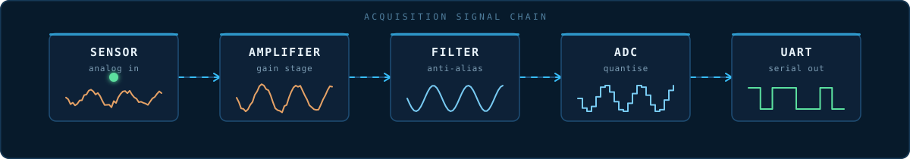

  

---

## About

Engineering student working across the hardware/software boundary — from Assembly on 8/16-bit
microcontrollers up to RF simulation and network design.

Most of what I build sits in the layer people usually skip: register-level drivers, impedance
matching, signal integrity, and the physical layer underneath the protocols. I care about
understanding the whole chain rather than treating any of it as a black box.

<!-- Replace the line below with what you're ACTUALLY working on right now.
     A specific, current project is the single most useful line on this page
     for anyone deciding whether to reach out. -->
**Currently:** deepening my embedded work — moving from bare-metal toward
RTOS-based firmware, and building out my PCB and RF simulation portfolio.

---

## Tech Stack

**Languages**

**Embedded & Hardware**

**RF & Signal Processing**

**Networking**

**Environment**

---

## Projects

<table>
<tr>
<td width="50%" valign="top">

### Autonomous Competition Robot
**Coupe de Robotique 2025**

Fully autonomous robot for a timed match: obstacle detection from
onboard sensors, DC motor control under PI regulation, and a
hardware timer driving the match state machine.

`C` `Embedded C` `PI Control` `Sensor Interfacing`

<!-- [Repository →](https://github.com/ninocity31/REPO-NAME) -->

</td>
<td width="50%" valign="top">

### Class-AB RF Power Amplifier
**Keysight ADS**

RF design flow end to end: bias point selection, input/output
impedance matching networks, S-parameter extraction, and gain
and stability analysis across the operating band.

`Keysight ADS` `S-Parameters` `Smith Chart` `Impedance Matching`

<!-- [Repository →](https://github.com/ninocity31/REPO-NAME) -->

</td>
</tr>
<tr>
<td width="50%" valign="top">

### Low-Power Sensor Board
**KiCad**

Complete board design around a low-power microcontroller —
schematic capture, power budgeting, decoupling strategy,
layout, and DRC-clean manufacturing output.

`KiCad` `Low-Power MCU` `Schematic Capture` `PCB Layout`

<!-- [Repository →](https://github.com/ninocity31/REPO-NAME) -->

</td>
<td width="50%" valign="top">

### Bare-Metal 68HC12 Firmware
**Assembly**

No HAL, no libraries — direct register access. GPIO drivers,
interrupt service routines, timer configuration, and a
UART driver for serial communication.

`68HC12 Assembly` `ISRs` `Timers` `UART`

<!-- [Repository →](https://github.com/ninocity31/REPO-NAME) -->

</td>
</tr>
<tr>
<td width="50%" valign="top">

### Network Design & Traffic Analysis
**Packet Tracer + Wireshark**

Multi-subnet topologies built and addressed in Packet Tracer,
then validated by capturing and dissecting the resulting
traffic in Wireshark down to the frame level.

`Cisco IOS` `TCP/IP` `Subnetting` `Wireshark`

<!-- [Repository →](https://github.com/ninocity31/REPO-NAME) -->

</td>
<td width="50%" valign="top">

### DSP Signal Chain
**MATLAB**

Digital filter design, FFT-based spectral analysis, additive
noise modelling, and simulation of a full acquisition-to-output
signal chain.

`MATLAB` `FFT` `Digital Filtering` `Noise Modelling`

<!-- [Repository →](https://github.com/ninocity31/REPO-NAME) -->

</td>
</tr>
</table>

---

  

**Open to internships and collaboration in embedded systems, RF, and networking.**

<a href="https://www.linkedin.com/in/mouradi-souhail">LinkedIn</a> ·
<a href="mailto:souhailmouradi2004@gmail.com">Email</a>

